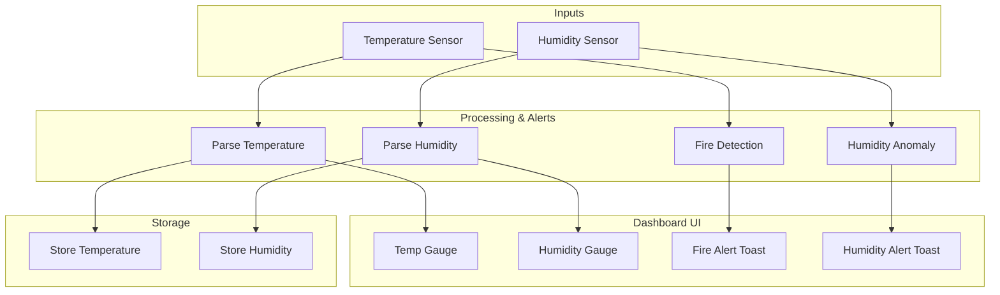

# IoT Temperature & Humidity Monitoring System

## 📋 Project Overview

This project implements a complete IoT solution for temperature and humidity monitoring with fire detection capabilities. It was developed as part of the MSC Advanced Computer Systems Technologies course at the University of West Attica.

### 🎯 Features

- **Real-time Sensor Monitoring**: Simulated temperature and humidity sensors
- **MQTT Communication**: Lightweight messaging protocol for IoT devices
- **Interactive Dashboard**: Web-based visualization with charts and gauges
- **Fire Detection System**: Automated alert system for temperature anomalies
- **Humidity Anomaly Detection**: Monitoring for extreme humidity conditions
- **Containerized Deployment**: Docker-based architecture for easy deployment
- **Historical Data Visualization**: Time-series charts for trend analysis

## 🏗️ System Architecture

```
┌─────────────────┐    MQTT    ┌─────────────────┐    MQTT   ┌─────────────────┐
│   IoT Device    │ ────────►  │  MQTT Broker    │ ────────► │   Node-RED      │
│ (Python Script) │  Publish   │  (Mosquitto)    │ Subscribe │   Dashboard     │
│                 │            │                 │           │                 │
│ Temperature     │            │ Port: 1883      │           │ Port: 1880      │
│ Humidity        │            │ WebSocket: 1883 │           │ Fire Detection  │
│ Device ID       │            │                 │           │ Data Storage    │
└─────────────────┘            └─────────────────┘           └─────────────────┘
```

### Node-RED Flow Diagram

The following diagram illustrates the cleaned-up Node-RED flow for the IoT Temperature & Humidity Monitoring System:



## 📦 Components

### 1. IoT Device Simulator (`iot-device/`)
- **Language**: Python 3
- **Main Script**: `sensor_simulator.py`
- **Dependencies**: paho-mqtt, numpy
- **Configuration**: `config.json`

### 2. MQTT Broker (`mosquitto/`)
- **Service**: Eclipse Mosquitto
- **Protocol**: MQTT v3.1.1
- **Ports**: 1883 (MQTT)
- **Configuration**: `mosquitto.conf`

### 3. Node-RED Dashboard (`nodered/`)
- **Platform**: Node-RED
- **Interface**: Web Dashboard
- **Features**: Real-time charts, gauges, alerts
- **Data Flow**: `flows.json`

## 🚀 Quick Start

### Prerequisites

- Docker Desktop (Download from: https://docs.docker.com/get-docker/)
- Python 3.8+ (Download from: https://www.python.org/downloads/)
- Git

### Running the System

#### Method 1: Automated Startup (Recommended)
```bash
# Make the startup script executable (first time only)
chmod +x start_system.sh

# Run the automated startup script
./start_system.sh
```

#### Method 2: Manual Step-by-Step

**Step 1: Start the Infrastructure**
```bash
docker-compose up -d
```

**Step 2: Wait for Services (about 30 seconds)**
```bash
# Check if containers are running
docker-compose ps
```

**Step 3: Install Python Dependencies**
```bash
# Create and activate a Python virtual environment
python3 -m venv venv
source venv/bin/activate

# Install Python dependencies
pip install -r iot-device/requirements.txt
pip install requests paho-mqtt numpy
```

**Step 4: Access Node-RED Editor**
- Open your web browser
- Go to: http://localhost:1880
- You should see the Node-RED interface with pre-configured flows
- Click the **"Deploy"** button (red button in the top-right corner)

**Step 5: Start the IoT Device Simulator**
```bash
# Open a new terminal window, activate the virtual environment, and start the simulator
source venv/bin/activate
python3 iot-device/sensor_simulator.py
```

**Step 6: View the Dashboard**
- Open your web browser
- Go to: http://localhost:1880/ui
- You should see the IoT dashboard with gauges and charts updating in real-time

### What You Should See

#### 1. Terminal Output (IoT Simulator)
```
🌡️  IoT Temperature & Humidity Sensor Simulator
==================================================
University of West Attica - MSC IoT Exercise
Advanced Computer Systems Technologies
==================================================
2024-01-01 12:00:00,123 - INFO - 🚀 Starting IoT Sensor Simulation
2024-01-01 12:00:01,200 - INFO - Connected to MQTT Broker successfully
2024-01-01 12:00:01,250 - INFO - 📊 Published: Temp=23.2°C, Humidity=65.4% [Fire Risk: False]
```

#### 2. Node-RED Editor (http://localhost:1880)
- Flow diagram with connected nodes
- Green "connected" status under MQTT nodes
- No error messages in the debug panel

#### 3. Dashboard (http://localhost:1880/ui)
- Temperature gauge showing current temperature
- Humidity gauge showing current humidity
- Line charts showing historical data trends
- Alert notifications when temperature > 40°C

### How to Stop the System

#### Stop IoT Simulator
- Press `Ctrl+C` in the terminal running the simulator

#### Stop Docker Containers
```bash
docker-compose down
```

### How to Restart the System

```bash
docker-compose restart
```

### Testing Fire Detection

To test the fire detection system:

1. Edit `iot-device/config.json`
2. Change `"fire_threshold": 40.0` to `"fire_threshold": 20.0`
3. Or change `"anomaly_probability": 0.05` to `"anomaly_probability": 0.3`
4. Restart the IoT simulator
5. Watch for fire alerts in the dashboard

## 📊 Dashboard Features

### Real-time Monitoring
- **Temperature Gauge**: Visual indicator with color-coded zones
- **Humidity Gauge**: Percentage display with safe/warning zones
- **Live Charts**: Time-series data visualization

### Alert System
- **Fire Detection**: Automatic alerts when temperature exceeds 40°C
- **Humidity Alerts**: Warnings for extreme humidity conditions
- **Toast Notifications**: Pop-up alerts for immediate attention
- **Visual Indicators**: Color-coded status displays

### Data Analysis
- **Historical Trends**: 1-hour rolling window of sensor data
- **Anomaly Detection**: Automated identification of unusual patterns
- **Device Status**: Real-time connection and health monitoring

## ⚙️ Configuration

### IoT Device Configuration (`iot-device/config.json`)

```json
{
  "device": {
    "id": "raspberry_pi_001",
    "name": "IoT Temperature & Humidity Sensor",
    "location": "Laboratory Room 101"
  },
  "mqtt": {
    "broker_host": "localhost",
    "broker_port": 1883,
    "topic_temperature": "sensors/temperature",
    "topic_humidity": "sensors/humidity"
  },
  "sensors": {
    "temperature": {
      "unit": "°C",
      "fire_threshold": 40.0
    },
    "humidity": {
      "unit": "%",
      "low_threshold": 20.0,
      "high_threshold": 85.0
    }
  },
  "simulation": {
    "publish_interval": 5,
    "enable_anomalies": true
  }
}
```

### MQTT Topics

- `sensors/temperature`: Temperature readings with metadata
- `sensors/humidity`: Humidity readings with metadata
- `nodered/status`: Node-RED connection status

## 🔧 Development

### Adding New Sensors

1. Modify `sensor_simulator.py` to include new sensor types
2. Update `config.json` with sensor parameters
3. Create new MQTT topics in Node-RED flows
4. Add dashboard widgets for visualization

### Customizing Alerts

1. Edit fire detection thresholds in `config.json`
2. Modify alert logic in Node-RED function nodes
3. Customize notification messages and display

### Data Persistence

- MQTT broker data is persisted in Docker volumes
- Node-RED flows are stored in `nodered/data/`
- Historical data retention: 1 hour (configurable)

## 📋 MQTT Message Format

### Temperature Message
```json
{
  "device_id": "raspberry_pi_001",
  "device_name": "IoT Temperature & Humidity Sensor",
  "location": "Laboratory Room 101",
  "timestamp": "2024-01-01T12:00:00Z",
  "sensor_type": "temperature",
  "value": 23.5,
  "unit": "°C",
  "fire_threshold": 40.0,
  "fire_risk": false,
  "quality": "good"
}
```

### Humidity Message
```json
{
  "device_id": "raspberry_pi_001",
  "device_name": "IoT Temperature & Humidity Sensor",
  "location": "Laboratory Room 101",
  "timestamp": "2024-01-01T12:00:00Z",
  "sensor_type": "humidity",
  "value": 65.2,
  "unit": "%",
  "low_threshold": 20.0,
  "high_threshold": 85.0,
  "anomaly": false,
  "quality": "good"
}
```

## 🛠️ Troubleshooting

### Common Issues

1.  **`[Errno 61] Connection refused` when running `sensor_simulator.py`**:
    *   **Cause**: The Docker containers are not running.
    *   **Solution**: Run `docker-compose up -d` and wait about 30 seconds for the services to start. Verify they are running with `docker-compose ps`.

2.  **`ModuleNotFoundError` when running Python scripts**:
    *   **Cause**: The Python virtual environment is not activated, or the dependencies are not installed.
    *   **Solution**:
        1.  Activate the virtual environment: `source venv/bin/activate`
        2.  Install the dependencies: `pip install -r iot-device/requirements.txt && pip install requests paho-mqtt numpy`

3.  **Dashboard is not loading at `http://localhost:1880/ui`**:
    *   **Cause**: The `node-red-dashboard` package may not be installed in Node-RED.
    *   **Solution**:
        1.  Go to the Node-RED editor: `http://localhost:1880`
        2.  Click the hamburger menu (top-right) > "Manage palette".
        3.  Go to the "Install" tab and search for `node-red-dashboard`.
        4.  Click "Install".
        5.  Click the "Deploy" button.

4.  **Docker containers won't start**:
    *   **Cause**: Docker Desktop might not be running.
    *   **Solution**:
        ```bash
        # Make sure Docker Desktop is running
        docker info

        # If Docker isn't running, start Docker Desktop application
        ```

5.  **"Cannot connect to MQTT broker"**:
    *   **Cause**: MQTT broker container might not be running properly.
    *   **Solution**:
        ```bash
        # Check container status
        docker-compose ps

        # Restart containers if needed
        docker-compose restart

        # View logs for issues
        docker-compose logs
        ```

6.  **No data in dashboard**:
    *   **Cause**: IoT simulator might not be running or MQTT connection issues.
    *   **Solution**:
        1. Make sure IoT simulator is running: `python3 sensor_simulator.py`
        2. Check Node-RED flows are deployed (click Deploy button)
        3. Verify MQTT connection (green status in Node-RED)

### Log Files

- **MQTT Broker**: `docker-compose logs mosquitto`
- **Node-RED**: `docker-compose logs nodered`
- **IoT Simulator**: Console output with timestamps

## 🎓 Academic Context

**Course**: Advanced Computer Systems Technologies  
**Institution**: University of West Attica  
**Program**: MSC in Advanced Computer Systems Technologies  
**Year**: 2024-2025

This project demonstrates:
- IoT system design and implementation
- MQTT protocol usage for lightweight messaging
- Containerized application deployment
- Real-time data visualization
- Automated alert systems
- Fire detection algorithms

## 📄 License

This project is developed for educational purposes as part of the MSC program at the University of West Attica.

**Note**: This is a simulated IoT environment designed for educational purposes. In a production environment, additional security measures, authentication, and monitoring would be required.
