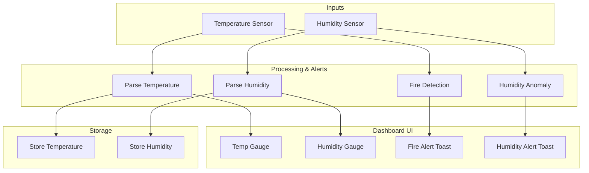

# Node-RED Flow Diagram

This diagram illustrates the cleaned-up Node-RED flow for the IoT Temperature & Humidity Monitoring System.

```mermaid
flowchart TD
 subgraph Inputs["Inputs"]
        A["Temperature Sensor"]
        B["Humidity Sensor"]
  end
 subgraph subGraph1["Processing & Alerts"]
        C["Parse Temperature"]
        D["Parse Humidity"]
        E["Fire Detection"]
        F["Humidity Anomaly"]
  end
 subgraph subGraph2["Dashboard UI"]
        G["Temp Gauge"]
        H["Humidity Gauge"]
        K["Fire Alert Toast"]
        L["Humidity Alert Toast"]
  end
 subgraph Storage["Storage"]
        M["Store Temperature"]
        N["Store Humidity"]
  end
    A --> C & E
    B --> D & F
    C --> G & M
    D --> H & N
    E --> K
    F --> L
```