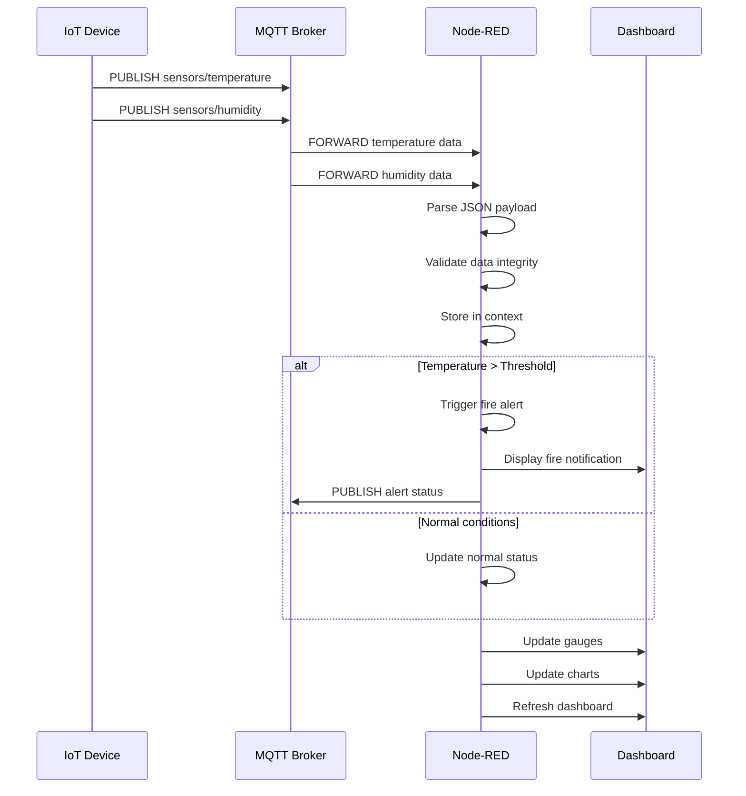

# System Patterns: IoT Temperature & Humidity Monitoring System

## 1. System Architecture

The system follows a classic, four-layered IoT architecture:

```
┌─────────────────────────────────────────────────────────────────┐
│                     Presentation Layer                          │
│  ┌─────────────────┐  ┌─────────────────┐  ┌─────────────────┐  │
│  │   Dashboard     │  │    Alerts       │  │    Charts       │  │
│  │   (Web UI)      │  │  (Notifications)│  │ (Visualization) │  │
│  └─────────────────┘  └─────────────────┘  └─────────────────┘  │
└─────────────────────────────────────────────────────────────────┘
┌─────────────────────────────────────────────────────────────────┐
│                    Processing Layer                             │
│  ┌─────────────────┐  ┌─────────────────┐  ┌─────────────────┐  │
│  │   Node-RED      │  │ Fire Detection  │  │ Data Storage    │  │
│  │   Flows         │  │    Logic        │  │   & History     │  │
│  └─────────────────┘  └─────────────────┘  └─────────────────┘  │
└─────────────────────────────────────────────────────────────────┘
┌─────────────────────────────────────────────────────────────────┐
│                   Communication Layer                           │
│  ┌─────────────────┐  ┌─────────────────┐  ┌─────────────────┐  │
│  │  MQTT Broker    │  │    Topics       │  │   QoS & Retain  │  │
│  │  (Mosquitto)    │  │   Management    │  │   Policies      │  │
│  └─────────────────┘  └─────────────────┘  └─────────────────┘  │
└─────────────────────────────────────────────────────────────────┘
┌─────────────────────────────────────────────────────────────────┐
│                      Device Layer                               │
│  ┌─────────────────┐  ┌─────────────────┐  ┌─────────────────┐  │
│  │  IoT Simulator  │  │    Sensors      │  │  Device State   │  │
│  │ (Python Script) │  │ (Temp/Humidity) │  │   Management    │  │
│  └─────────────────┘  └─────────────────┘  └─────────────────┘  │
└─────────────────────────────────────────────────────────────────┘
```

## 2. Key Design Patterns

-   **Publish/Subscribe (Pub/Sub)**: The entire system is built around the pub/sub pattern, with MQTT as the enabling technology. This creates a loosely coupled and scalable architecture.
-   **Containerization**: All backend services are containerized using Docker. This ensures a consistent and reproducible environment, simplifying deployment and reducing "it works on my machine" issues.
-   **Flow-Based Programming**: Node-RED uses a visual, flow-based programming model. This makes it easy to create and modify the data processing logic without writing a lot of code.
-   **Simulator**: The use of a Python script to simulate the IoT device allows for development and testing without the need for physical hardware.

## 3. Data Flow

### Message Flow Sequence


### Data Processing Pipeline
```
Raw Sensor Data → JSON Parsing → Validation → Enhancement → Storage → Visualization
                                    ↓              ↓          ↓
                                Anomaly         Alert      Historical
                                Detection    Generation    Analysis
```
